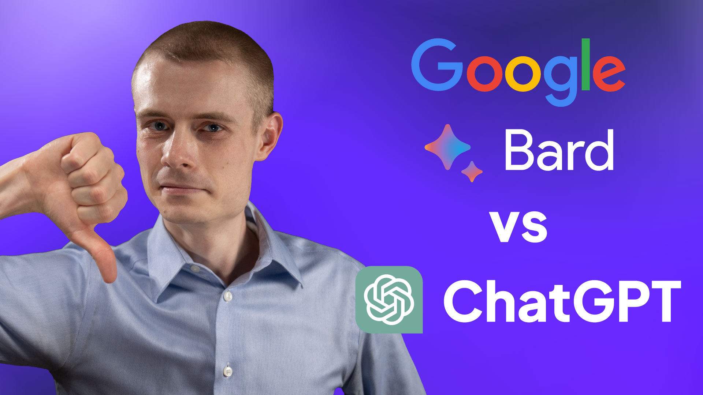

# AI Coding Assistant: Is Google Bard Better than ChatGPT?

I've already successfully built one app entirely with ChatGPT and GPT-4, but ChatGPT isn't the only AI game in town. Google's answer to ChatGPT is affectionately known as Google Bard, and it claims to understand code better than GPT. So, we will put it to the test.

Can Google Bard build the same app I instructed ChatGPT to build?

Can it do it faster?

Let's find out.

- [Video](https://youtu.be/XlitNIdfNhw)
- Start tag: [link](releases/tag/start)
- Finish tag: [link](releases/tag/finish)
- Google Bard prompts: [link](https://tldr.st/AA)

